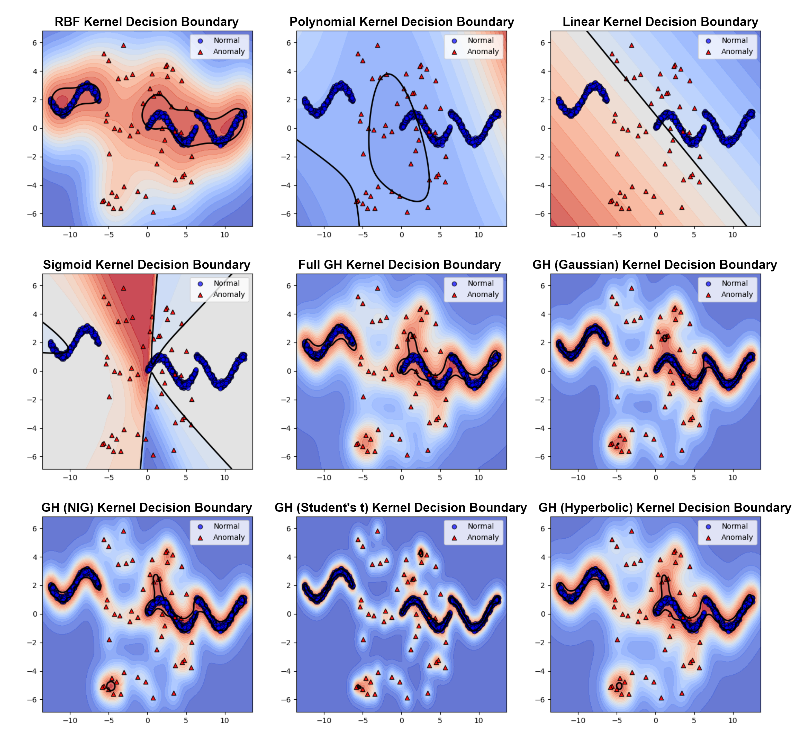

## Kernel-Based Anomaly Detection Using Generalized Hyperbolic Processes [ICASSP 2025]

Official implementation of the paper ["Kernel-Based Anomaly Detection Using Generalized Hyperbolic Processes"](https://arxiv.org/abs/2501.15265).

Authors: [Pauline Bourigault](https://profiles.imperial.ac.uk/p.bourigault22), [Danilo P. Mandic](https://profiles.imperial.ac.uk/d.mandic)

<hr />

## Highlights

<div align="center">
  
</div>

> **Abstract:** *We present a novel approach to anomaly detection by integrating Generalized Hyperbolic (GH) processes into kernel-based methods. The GH distribution, known for its flexibility in modeling skewness, heavy tails, and kurtosis, helps to capture complex patterns in data that deviate from Gaussian assumptions. We propose a GH-based kernel function and utilize it within Kernel Density Estimation (KDE) and One-Class Support Vector Machines (OCSVM) to develop anomaly detection frameworks. Theoretical results confirmed the positive semi-definiteness and consistency of the GH-based kernel, ensuring its suitability for machine learning applications. Empirical evaluation on synthetic and real-world datasets showed that our method improves detection performance in scenarios involving heavy-tailed and asymmetric or imbalanced distributions.

## **Repository Structure**

The repository includes the following Python scripts in the src folder:

| File                               | Description                                                                 |
|------------------------------------|-----------------------------------------------------------------------------|
| `KDE_GH_standard_kernels.py`       | Implements KDE using Generalized Hyperbolic (GH) kernels (Full GH Kernel, Gaussian, NIG, Student's t, Hyperbolic) and standard kernels (Gaussian, Tophat, Exponential, Epanechnikov). |
| `OCSVM_GH_standard_kernels.py`     | Implements One-Class SVM with GH (Full GH Kernel, Gaussian, NIG, Student's t, Hyperbolic) and standard (RBF, Polynomial, Linear, Sigmoid) kernels.                     |
| `dagmm_anomaly_detection.py`       | Implements Deep Autoencoding Gaussian Mixture Model (DAGMM) for anomaly detection. |
| `deep_svdd_anomaly_detection.py`   | Implements Deep Support Vector Data Description (Deep SVDD).               |
| `isolation_forest_anomaly_detection.py` | Implements Isolation Forest for anomaly detection.                     |
| `memae_anomaly_detection.py`       | Implements Memory-Augmented Autoencoder (MemAE) for anomaly detection.     |
| `ocnn_anomaly_detection.py`        | Implements One-Class Neural Network (OC-NN) for anomaly detection.         |
| `vae_anomaly_detection.py`         | Implements Variational Autoencoder (VAE) for anomaly detection.            |
| `vanilla_autoencoder_anomaly_detection.py` | Implements a simple Autoencoder for anomaly detection.                   |

## Usage

Each script is self-contained and can be run independently. For example, to run the OCSVM method using Generalized Hyperbolic (GH) kernels (Full GH Kernel, Gaussian, NIG, Student's t, Hyperbolic) and standard kernels (Gaussian, Tophat, Exponential, Epanechnikov) implementation:

```bash
# pip environment
   conda create -n ghkernel python=3.8
   conda activate ghkernel
# pip according to the requirement.txt
   pip install -r requirement.txt
# run for example the OCSVM method using the GH and standard kernels for anomaly detection on the generated dataset
   python src/OCSVM_GH_standard_kernels.py
```

## Citation

If you think our work is useful, please consider citing:

```bibtex
@inproceedings{bourigault2025ghanomalydetect,
title={Kernel-Based Anomaly Detection Using Generalized Hyperbolic Processes},
author={Bourigault, Pauline and Mandic, Danilo},
booktitle={ICASSP 2025-2025 IEEE International Conference on Acoustics, Speech and Signal Processing (ICASSP)},
year={2025},
organization={IEEE}
}
```
